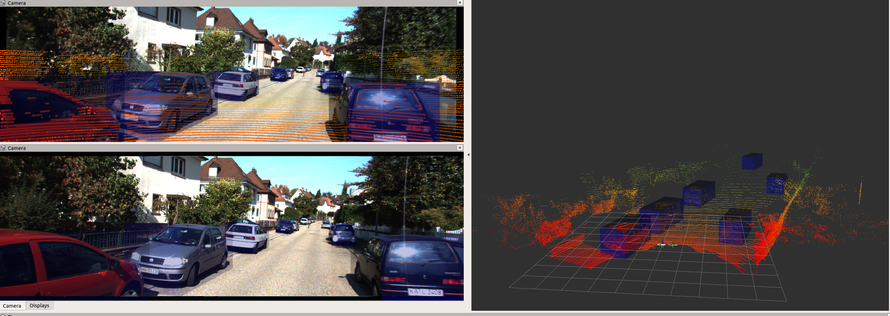
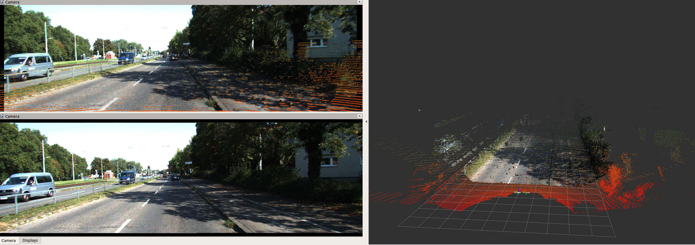

# Kitti Visualization

Ros package to visualize KITTI object data, raw data, and depth prediction data with RVIZ

## Getting Started:

### Data Preparation

You can use this repo with either or both KITTI [object dataset](https://www.cvlibs.net/datasets/kitti/eval_object.php?obj_benchmark=3d) and [raw dataset](https://www.cvlibs.net/datasets/kitti/raw_data.php).  The code will not raise error until the data is actually being read, so if you are using only object dataset or only raw dataset, the code will still work fine (the dataset selection is controlled by a FLAG in the launch file). 

If you need oxts poses/odometry support for raw dataset. Please refer to this [naive method](https://gist.github.com/Owen-Liuyuxuan/27f12e15788acba76053df84a28f2291) to produce poses for every sequence. Otherwise, we will simply publish a identity transform between baselink and odom.

### Software Prerequisite

This repo runs with ROS2 python3 (humble), and we expect PyQt5 correctly setup with ROS installation.

Clone the repo under the {workspace}/src/ folder. Overwrite the folder names in the [launch file](../launch/kitti_launch.xml) to point to your data. 

Install and launch everything based on the [Install Steps](../readme.md)

### Core Features:

- [x] KITTI object detection dataset support. 
- [x] KITTI raw data sequence support. 
- [x] KITTI depth prediction support. 
- [x] Stereo RGB cameras.
- [x] Filtered LiDAR, RGB point clouds.
- [x] Ground truth bounding boxes.
- [x] TF-tree (camera and LiDAR).
- [x] GUI control & ROS topic control.
- [ ] IMU tf trees.

## GUI

### User manual:

    index: integer selection notice do not overflow the index number (especially for kitti object dataset)

    Stop: stop any data loading or processing of the visualization node.
    
    Pause: prevent pointer of the sequantial data stream from increasing, keep the current scene.

    Cancel: quit. (click this before killing the entire launch process)

## Object Detection

Following the file structure of kitti object detection dataset. Point clouds, stereo images, object labels are loaded and published

## Raw Data & Depth Prediction Dataset

We support video-like streaming raw data. Depth Prediction dataset follows similar structure of raw data, thus can be visualized in RGB point clouds together(optionally). 

## ROS Topics

### Published Topics

/kitti/left_camera/image ([sensor_msgs/Image](https://docs.ros2.org/latest/api/sensor_msgs/msg/Image.html))

/kitti/right_camera/image ([sensor_msgs/Image](https://docs.ros2.org/latest/api/sensor_msgs/msg/Image.html))

/kitti/left_camera/camera_info ([sensor_msgs/CameraInfo](https://docs.ros2.org/latest/api/sensor_msgs/msg/CameraInfo.html))

/kitti/right_camera/camera_info ([sensor_msgs/CameraInfo](https://docs.ros2.org/latest/api/sensor_msgs/msg/CameraInfo.html))

/kitti/lidar ([sensor_msgs/PointCloud2](https://docs.ros2.org/latest/api/sensor_msgs/msg/PointCloud2.html))

/kitti/left_camera_pc ([sensor_msgs/PointCloud2](https://docs.ros2.org/latest/api/sensor_msgs/msg/PointCloud2.html))

/kitti/bboxes ([visualization_msgs/MarkerArray](https://docs.ros2.org/foxy/api/visualization_msgs/msg/MarkerArray.html))

The tf trees are also well constructed. We have a predefined rviz file for visualizing all topics and tf trees.

### Beta Features:

Features that are supported with some tricks.

- [x] Odometry supported in sequence reading and will publish to the TF tree.

#### Odometry support:

We can use the oxts measurement in the raw dataset to obtain a pose for each frame to enable a truly sequential visualization. In this repo, we first refer to this [naive method](https://gist.github.com/Owen-Liuyuxuan/27f12e15788acba76053df84a28f2291) to produce poses for every sequence. Then in this repo, we will publish a tf transform from odom to baselink based on the poses matrix. 
