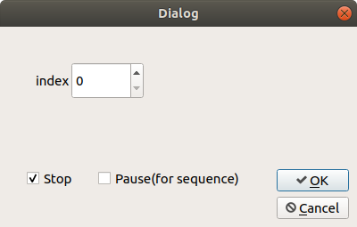

# ROS2 Dataset Bridge

ROS2 dataset bridge to visualize kitti/kitti360/nuscenes datasets in **ROS2** and visualize in **RVIZ2**, come with a GUI for visualization control.

You could checkout the ROS1 version of each visualization package:

- [KITTI ROS1](https://github.com/Owen-Liuyuxuan/kitti_visualize)
- [KITTI360 ROS1](https://github.com/Owen-Liuyuxuan/kitti360_visualize)
- [Nuscenes ROS1](https://github.com/Owen-Liuyuxuan/nuscenes_visualize)

In this repo, we fully re-structure the code and messages formats for ROS2 (humble), and ~~try to~~ integrate the ROS interface for all these three datasets.

## Getting Started:

### Data Preparation

Check the setting up for each dataset. It is ok to have only either one dataset and get the code running. [KITTI](docs/kitti_readme.md), [KITTI360](docs/kitti360_readme.md), [nuscenes](docs/nusc_readme.md).

For customed dataset, it also works as long as it confined with the format of each dataset (mainly tested with KITTI dataset and KITTI360 dataset, because they are easy to construct).

### Software Prerequisite

This repo runs with ROS2 python3 (humble), and we expect PyQt5 correctly setup with ROS installation.

Clone the repo under the {workspace}/src/ folder. Overwrite the folder names in the [launch file](./launch) to point to your data.

```bash
cd ros2_ws/src
git clone https://github.com/Owen-Liuyuxuan/ros2_dataset_bridge
cd ..

# modify and check the data path!! Also control the publishing frequency of the data stream.
nano src/ros2_dataset_bridge/launch/kitti_launch.xml 

colcon build --symlink-install
source install/setup.bash # install/setup.zsh or install/setup.sh for your own need.

# this will launch the data publisher / rviz / GUI controller
ros2 launch ros2_dataset_bridge kitti_launch.xml # kitti360_launch.xml / nuscenes_launch.xml 
```

Notice that as a known issue from [ros2 python package](https://github.com/ros2/launch/issues/187). The launch/rviz files are copied but not symlinked when we run "colcon build",
so **whenever we modify the launch file, we need to rebuild the package**; whenever we want to modify the rviz file, we need to save it explicitly in the src folder.

```bash
colcon build --symlink-install --packages-select=ros2_dataset_bridge # rebuilding only ros2_dataset_bridge
```

### Core Features:

- [x] Full support for Image, LiDAR and bounding boxes. 
- [x] TF-tree (camera and LiDAR).
- [x] GUI control & ROS topic control.


## GUI



### User manual:

    index: integer selection, notice do not overflow the index number.

    Stop: stop any data loading or processing of the visualization node.
    
    Pause: prevent pointer of the sequantial data stream from increasing, keep the current frame.

    Cancel: quit. (click this before killing the entire launch process)


### ROS Topics

Please check each datasets.

The tf trees are also well constructed. We have a predefined rviz file for visualizing all topics and tf trees.